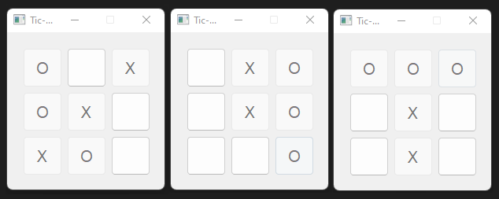

# pyqt5TicTacToe
> An implementation of Tic-Tac-Toe Gamge using PyQt5


## About
Tic Tac Toe is a popular game that dates back 3000 years. This game is great fun for players of all ages and provides a great brain workout too! A game for two players who take turns marking spaces in a three by three grid with X's or O's. The player who succeeds in placing three symbols in a row horizontally, vertically or diagonally wins.



The goal of this fun challenge is to implement Tic Tac Toe using Python and the PyQT library to design the user interface.

## Installing Requirements
```sh
    python -m pip install -r requirements.txt
```

## Run
```sh
    python TicTacToe.py
```

## TODO
- [ ] Improved user interface details
- [ ] Playing with the computer
- [ ] Using machine learning algorithms to improve the level of computer games
- [ ] ...
